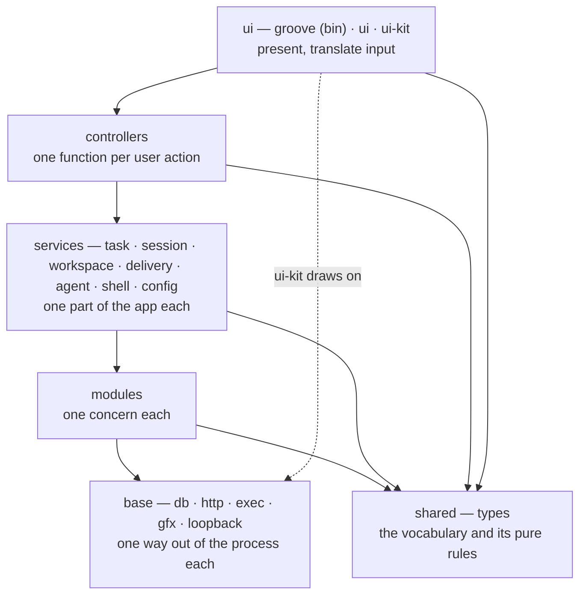
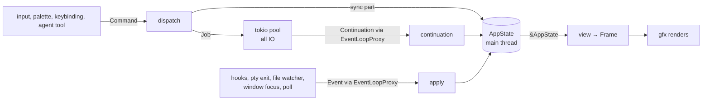

# Architecture

A Cargo workspace in six [layers](glossary.md#layer). The simplest code is at the
bottom, called by the layer above it. Nothing calls up. This file holds the rules; the
code holds the how. [trace.md](trace.md) follows one action through all of it.

## Layers

Each crate's directory is its layer: `crates/<layer>/<crate>`. What a crate holds is its
`description` in `Cargo.toml` and its `//!` doc; this file does not repeat them.

## Who does what

| Layer | Does | Never |
|---|---|---|
| **base** | one way out of the process: disk state, network, a process, the GPU | holds application logic; knows a domain type |
| **shared** | `types`: the data every layer talks in, and pure rules over it | IO, async, anything with a side effect |
| **modules** | one concern, on the base; IO exposed only as `async fn` | calls a service; knows a user action; offers a blocking path to IO |
| **services** | one part of the app: its slice of `AppState` and the operations on it | calls another service; orders work across services |
| **controllers** | one function per user action: which services, in what order, what to undo on failure | touches a module directly; holds state |
| **ui** | draws `AppState` as a `Frame`; turns input into a controller call | calls a service; decides an order |

## Rules

Each rule has an example, and names the test that enforces it. A rule no test can check
says so.

**A dependency points down the layers.** A service depends on modules and `types`; a
module on the base, `types` and other modules.
*Example:* `groove-workspace-service` depends on `groove-git`; `groove-git` never depends
on a service.
Enforced by `every_dependency_points_down_the_layers`.

**A service never depends on a service.** Work that spans two services is a
controller's.
*Example:* after a push, `workspace` does not tell `delivery` to poll again; the
controller calls `state.delivery.poll.forget` itself.
Enforced by `no_service_depends_on_a_service`.

**A controller function is the only place two services meet**, and the only place
that knows what to undo when a later step fails.
*Example:* `task.finish` tells the provider the task is done, then asks `session` to tear
the worktrees down; a teardown that fails leaves the status as it was.
Not enforced by a test.

**One function is one action**, whether it calls one service or four. A read is a
controller function too, and mutates nothing.
*Example:* `workspace.get_commits` is a read; `workspace.push` is a write. Both are one
variant of `workspace::Command`.
Not enforced by a test.

**The command id is `controller.function`.** That one string is the palette entry, the
keybinding target, the agent's tool name and the timeline label. The namespace stays
flat however the code is split.
*Example:* `workspace.push`, from `Command::id`, whether it lives in `workspace.rs` or
`workspace/git.rs`.
Not enforced by a test.

**The controllers are the API.** A function nobody can reach, and a palette entry or tool
that is not a function, are both defects.
*Example:* the agent's `git_push` tool calls the same `remote` the commit box does.
Enforced by `every_tool_groove_lists_is_one_it_answers_and_a_write_with_nothing_to_act_on_refuses`.

**`AppState` is the sum of the services' slices**, owned on the main thread. A
controller receives it whole and hands each service its slice.
*Example:* `state.session`, `state.workspace`, `state.delivery`: one field a service.
Enforced by the compiler.

**Every concept has one home.** Whatever needs it calls that home and never derives it
again.
*Example:* a worktree's base branch is `base_ref` in `git`; the diff, the teardown and
the MR's target all ask it.
Not enforced by a test.

**A module keeps its own error enum only when a caller matches a variant**, or its
variants map to different kinds. Every other module returns `groove_types::Error`.
*Example:* `agent-launch` has one way to fail, so it returns `groove_types::Error`.
Not enforced by a test.

## Splitting what grows

Growth is answered inside the services and controllers that exist.

- **A big service splits into files**, one a tool set.
  *Example:* the `workspace` service holds `blame.rs`, `buffers.rs`, `git.rs` and
  `paths.rs`.
- **A controller splits the same way**, into a directory beside its file. The `Command`
  enum and `dispatch` stay in the file, so the action list reads in one place.
- **A view file draws one region.** Over the ceiling it becomes a directory named after
  the region, one file per part. No bucket names: a directory is a region, never
  `components`.
- **Ui state sits with its view.** `Ui` keeps only what crosses views: focus, the splits,
  the palette, the colour cache.
- **One module convention: `name.rs` beside `name/`.** No `mod.rs`. Not enforced by a test.
- **Ceilings:** 300 lines a file, 50 lines a function; a test file may stand to 500 and a
  test to 100, since a test is one scenario. Examples are exempt.
  Enforced by `no_file_stands_above_its_ceiling` and `no_function_stands_above_its_ceiling`.

## State and threads

- winit's event loop on the main thread owns `AppState`.
- Every IO call runs on the tokio pool. Its result comes back as a
  [continuation](glossary.md#continuation) through `EventLoopProxy`; the outside world
  comes back as an [event](glossary.md#event).
- `AppState` changes only in `dispatch`, a continuation or `apply`. One writer, one
  thread.
- Render reads `&AppState`. No second copy, no sync, no `Arc<Mutex<_>>`.
- Periodic work is spawned on the same pool and reports through the same channel. Window
  focus is an input to it.

**The one rule the compiler cannot enforce:** no IO in `dispatch`, `apply` or a
continuation. *Example:* `remote` reads the worktree's status inside its job, not in its
continuation. Not enforced by a test.

## Commands, continuations, events

Commands go down as data. Results come back as continuations. Events are the outside
world. One thread applies all three.

- **Command.** An enum grouped by controller, one variant per function, produced by ui
  input, the palette, a keybinding or an agent tool, never by a direct call.
- **Controller function.** The sync part changes `AppState` now. The async part is
  spawned through the `Spawner` and carries its continuation.
- **Continuation.** Runs on the main thread. It writes the result into the owning
  service's slice and records to the timeline when it should.
- **Generation.** A read that can be overtaken carries a number, or what it was asked
  for; its continuation drops an answer a newer read replaced. *Example:* `load` in
  `crates/controllers/controllers/src/workspace/diff.rs` counts `workspace.reads`.
- **Event.** External input with no originating command, applied by `apply`: a hook, an
  agent exit, terminal damage, a decision, a poll, a file change, window focus, a config
  change.

**Firehoses never enter the loop.** The terminal's reader thread parses bytes into the
grid and sets a dirty flag; one damage event a frame at most.

**Keystrokes never touch a device on the main thread.** The terminal module's writer
thread owns the pty's input side; send and resize queue on its channel and return.

**Redraw.** `ControlFlow::Wait`, a dirty flag, one `view(&AppState) → Frame` a batch.

## Rendering

`Frame` is a display list rebuilt every frame from `&AppState`. Widgets emit it; the
renderer draws it. Neither crate sees the other's types: `ui` never calls `gfx`
directly.

- **One glyph per cell** in the terminal and the code surface. No ligatures. A wide
  character takes two cells.
- **Box and block glyphs are quads**, decoded into per-side arm weights that tile exactly.
  Double-line and rounded glyphs stay on the font.
- **Never read the frame back.** The window presents.
- Rounded rects and borders: one SDF fragment shader. Clipping: a scissor per batch.
- **Chrome is owned and minimal**: about eight primitives on `gfx`, plus focus, hit
  testing and scroll. No general toolkit, no [layout engine](design.md#limits).
  `ui-kit` holds the context, tokens, styles, shapes, text and widgets on plain data, on
  `gfx` and `types` only. `ui` adds the hits and layout, components that know Groove's
  state, then the views.
- **Numbers only in the kit's tokens.** Enforced by `every_size_comes_from_the_tokens`.
- **Styles only in the kit's style file.** Enforced by `every_style_comes_from_one_file`.
- **A view draws only through the kit.** The context's drawing primitives are private
  to `ui-kit`, so the compiler refuses a view that paints by hand. A view takes only
  geometry from `gfx`: enforced by `a_view_draws_through_the_context`.
- **A new widget serves more than one view.** A part only one view draws stays in that
  view, made of kit widgets.
- **Typing goes through the input method.** What it composes shows underlined at the
  caret that has the keyboard, and its window opens there. What it commits types as
  keys do. Enforced by `a_commit_types_into_the_open_buffer_as_a_key_does`.

## Tests

| Layer | How |
|---|---|
| base | each crate standalone: an in-memory database; a mock server for `http` with redaction asserted on the wire; a scripted binary for `exec`; golden images from `Frame` fixtures for `gfx` |
| modules | each against the base: `forge` and `provider` on a fake `http`; `terminal` asserts the grid from a byte stream; `text` pure; `git` on temp repos with repo-local identity and no signing |
| services | each in isolation, on fakes of its modules |
| controllers | drive the API headlessly, assert `AppState`; a `SyncSpawner` runs the job and its continuation at once |
| ui | assert the `Frame` against a fixture `AppState`; no GPU |

A test states one behaviour we want, named as the sentence it asserts. Never "the bug
stays fixed", never where a thing sits or how it is spaced. A measurement harness is
`#[ignore]`d and named `time_*`.

The structure tests sit in `crates/controllers/controllers/src/tests/layers.rs` for the
layers and the ceilings, and in `crates/ui/ui/src/tests/structure.rs` for `ui` and
`ui-kit`. `crates/controllers/controllers/src/tests/docs.rs` holds these docs to the
code.

Golden images run on software Vulkan (`mesa-vulkan-drivers`, lavapipe) in CI. The fonts
are vendored: IBM Plex Sans and IBM Plex Mono, OFL.
