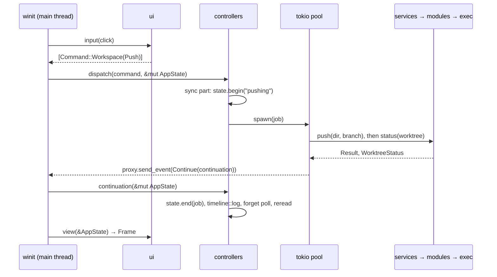

# One action, end to end: `workspace.push`

The user clicks **push** in the commit box. This page follows that click through every
layer of [architecture.md](architecture.md), to the line it leaves on the feed. Each
step names the file that does it.

## 1. Input becomes a command — `ui`

The binary receives the click in `crates/ui/groove/src/app/events.rs` and hands it to
`App::input` in `crates/ui/groove/src/app.rs`. That calls `groove_ui::input::handle`,
which finds the hit and returns the commands it means. Ui never runs an action itself.

The commit box offers one action at a time. `acting` in
`crates/ui/ui/src/input/pointer.rs` asks `commit::primary` in
`crates/ui/ui/src/views/session/commit.rs`, which reads the worktree's `Standing` and
returns `Command::Workspace(workspace::Command::Push)` while the branch is ahead.

The same command comes from the palette, through `worktree` in
`crates/ui/ui/src/views/overlays/actions.rs`. One action, one command, wherever it starts.

## 2. Dispatch — `controllers`

`App::input` calls `dispatch` in `crates/controllers/controllers/src/command.rs` with
`&mut AppState`. That is the one match on `Command`: it calls `workspace::dispatch` in
`crates/controllers/controllers/src/workspace.rs`, which matches `Command::Push` and calls
`on_remote` with `Remote::Push`.

`on_remote` reads the selected worktree from the `session` slice. With none selected it
does nothing. The command id, `workspace.push`, comes from `Command::id` and is the same
string as the palette entry and the timeline label.

## 3. The sync part, then the job — `controllers`

`remote` in `crates/controllers/controllers/src/workspace/git.rs` runs on the main thread:

- `state.begin("pushing")` marks a job the user waits on. The feed shows it at once.
- It builds a `Job`: an async block that owns copies of what it needs, never `AppState`.
- `spawner.spawn(job)` hands it to the tokio pool and returns. The main thread is free.

No IO has happened yet. `dispatch` never does IO.

## 4. The async part — `services`, `modules`, `base`

On the pool, the job calls `groove_workspace_service::push` in
`crates/services/workspace/src/git.rs`, which calls `Git::push` in
`crates/modules/git/src/remote.rs`:
`git push origin <branch>:<branch> --set-upstream`, run through `exec`.
The branch goes to its own name on origin and nowhere else.

Then the job reads the worktree's new git status through the `session` service, since a
push moves what origin holds. The job ends by returning its `Continuation`: a closure
that holds both results.

## 5. Back to the main thread — the binary

`TokioSpawner` in `crates/controllers/controllers/src/spawn.rs` delivers the continuation
to its sink. In the binary that sink is `Proxy` in `crates/ui/groove/src/main.rs`, which
sends `Message::Continue` through winit's `EventLoopProxy`. `user_event` in
`crates/ui/groove/src/app/events.rs` runs it with `&mut AppState`, then asks for a redraw.

In tests, `SyncSpawner` runs the job and keeps the continuation for `drain`. The same
controller code runs headless.

## 6. The continuation — `controllers`

The closure in `remote` runs on the main thread:

- `state.end(job)` clears the pending mark.
- On success:
  - `timeline::log` in `crates/controllers/controllers/src/timeline.rs` spawns a job that
    writes the line to the database. Its own continuation calls `logged` on the `session`
    slice, which puts the line at the top of the feed.
  - `state.delivery.poll.forget` makes the poll ask the forge about this worktree again,
    since a push can change its MR and CI.
  - `told` stores the new git status on the session.
  - `reread` reads the diff again. That read carries a
    [generation](glossary.md#generation): if a newer read starts first, this one's answer
    is dropped.
- `asker.answer` reports the result. For a click, a failure goes to the feed. For the
  agent's `git_push` tool, the agent hears it in words.

## 7. The frame — `ui`

The redraw calls `view(&AppState)`, which builds a new `Frame`. The commit box reads
`Standing` again: the branch is no longer ahead, so the button now offers the next step,
open an MR. Nothing in `ui` was told that the push succeeded. It reads the state.

## The same push from the agent

The agent calls the `git_push` tool. `push_asked` in
`crates/controllers/controllers/src/tools/write/git.rs` reads the commits the push would
send and queues an ask. When the user approves it, or at once with auto-approve on, the
same `remote` runs with `Asker::Agent`. From step 3 on, nothing differs.
